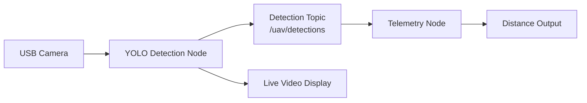

# IIT-B
# YOLOv5 Drone Detection & Telemetry System

[](https://docs.ros.org/en/humble/)
[](https://www.raspberrypi.com/products/raspberry-pi-4-model-b/)
[](https://releases.ubuntu.com/jammy/)
[](https://github.com/ultralytics/yolov5)

Real-time drone detection and distance estimation system optimized for edge deployment on Raspberry Pi 4 using ROS2 Humble. The system uses a YOLOv5 ONNX model for efficient CPU inference and provides telemetry data using triangle similarity for distance calculation.

## 📋 System Overview



## 🚀 Features

- **Real-time drone detection** using YOLOv5 ONNX model
- **Multi-threaded architecture** for smooth video playback during inference
- **Distance estimation** using triangle similarity formula
- **ROS2 Humble middleware** for node communication
- **Optimized for Raspberry Pi 4** with minimal resource usage
- **No GPU required** - runs entirely on CPU

## 📁 Project Structure

```
ros2_ws/
└── src/
    └── yolov5_ros/
        ├── models/
        │   └── best(416).onnx          # YOLOv5 ONNX model
        ├── yolov5_ros/
        │   ├── __init__.py
        │   ├── yolo_node.py             # Detection engine
        │   └── telemetry_node.py        # Distance computation
        ├── setup.py                       # ROS2 build configuration
        ├── package.xml                     # Package manifest
        └── README.md                        # This file
```

## 🔧 Hardware Requirements

- **Raspberry Pi 4 B** (2GB+ RAM recommended)
- **USB Camera** (plug into USB 3.0 blue port)
- **Cooling fan** (prevents thermal throttling)
- **Power supply** (5V/3A USB-C)

## 💻 Software Requirements

- **Ubuntu 22.04 LTS** (64-bit)
- **ROS2 Humble** desktop full installation
- **Python 3.10+**
- **OpenCV** with DNN module
- **v4l-utils** for camera configuration

## 📥 Installation

### 1. Install Ubuntu 22.04 LTS
Follow the official guide to install Ubuntu 22.04 LTS on your Raspberry Pi 4.

### 2. Install ROS2 Humble
```bash
# Add ROS2 repository
sudo apt update && sudo apt install curl gnupg lsb-release
sudo curl -sSL https://raw.githubusercontent.com/ros/rosdistro/master/ros.key -o /usr/share/keyrings/ros-archive-keyring.gpg

# Add repository to sources list
echo "deb [arch=$(dpkg --print-architecture) signed-by=/usr/share/keyrings/ros-archive-keyring.gpg] http://packages.ros.org/ros2/ubuntu $(source /etc/os-release && echo $UBUNTU_CODENAME) main" | sudo tee /etc/apt/sources.list.d/ros2.list > /dev/null

# Install ROS2 Humble
sudo apt update
sudo apt install ros-humble-desktop-full

# Source ROS2 in bashrc
echo "source /opt/ros/humble/setup.bash" >> ~/.bashrc
source ~/.bashrc
```

### 3. Install Dependencies
```bash
# System dependencies
sudo apt update && sudo apt upgrade -y
sudo apt install ros-humble-cv-bridge ros-humble-vision-msgs v4l-utils python3-pip -y

# Python packages
pip3 install opencv-python numpy
```

### 4. Create Workspace and Clone Repository
```bash
# Create workspace
mkdir -p ~/ros2_ws/src
cd ~/ros2_ws/src

# Clone repository
git clone https://github.com/yourusername/yolov5_ros.git

# Download YOLOv5 ONNX model
cd yolov5_ros/models
# Place your best(416).onnx model here
```

### 5. Set Camera Permissions
```bash
# Add user to video group
sudo usermod -aG video $USER

# Reboot to apply changes
sudo reboot
```

### 6. Build Workspace
```bash
cd ~/ros2_ws
colcon build --packages-select yolov5_ros
source install/setup.bash
```

## 🎮 Usage

### Terminal 1 - Start Detection Node
```bash
cd ~/ros2_ws
source install/setup.bash
ros2 run yolov5_ros yolo_node
```
Expected: Camera window opens showing live feed with green detection boxes.

### Terminal 2 - Start Telemetry Node
```bash
cd ~/ros2_ws
source install/setup.bash
ros2 run yolov5_ros telemetry_node
```
Expected: Continuous output showing:
```
STATUS: LOCKED
Distance: X meters
```

## 📐 Camera Calibration

For accurate distance measurement, calibrate the focal length:

1. Place drone exactly **1 meter** from camera
2. Note the pixel width printed by telemetry_node
3. Calculate focal length:
```python
FOCAL_LENGTH = (pixel_width × 1.0) / drone_real_width
```
4. Update value in `telemetry_node.py`:
```python
self.FOCAL_LENGTH = calculated_value  # Replace default 450.0
```

## 🔄 System Architecture

### Node Communication
```
[Camera] → [yolo_node] → /uav/detections → [telemetry_node] → [Console Output]
```

### Threading Architecture
```
Main Thread:
├── Camera Capture (continuous)
├── Display Window (30+ FPS)
└── Launch Inference Thread (if idle)

Inference Thread:
├── Preprocess Frame
├── Run ONNX Model
├── Apply NMS Filtering
└── Store Results

Publisher:
└── Send detections to ROS topic

Subscriber (telemetry_node):
├── Parse detection data
├── Calculate distance
└── Print telemetry
```

### Message Format
Detections published as string:
```
x_center,y_center,confidence,width|x_center,y_center,confidence,width
```
Example:
```
120,200,0.87,55|300,180,0.91,62
```

## ⚙️ Configuration

### Camera Settings
```bash
# List camera devices
v4l2-ctl --list-devices

# Adjust brightness (if needed)
v4l2-ctl -d /dev/video0 --set-ctrl brightness=150
```

### Performance Tuning
- Use **640×480** resolution for optimal speed
- Enable **active cooling** for sustained performance
- Close unnecessary background processes
- Ensure **stable lighting** conditions

## 🐛 Troubleshooting

### Model Not Found
```
Error: Model file not found at: models/best(416).onnx
Solution: Ensure model exists at: ~/ros2_ws/src/yolov5_ros/models/best(416).onnx
```

### Camera Not Detected
```bash
# Check camera presence
ls /dev/video*

# Should show /dev/video0
```

### ROS Commands Not Found
```bash
# Source ROS2 environment
source /opt/ros/humble/setup.bash
```

### Permission Denied for Camera
```bash
# Add user to video group
sudo usermod -aG video $USER
# Reboot required
```

### Build Errors
```bash
# Clean and rebuild
cd ~/ros2_ws
rm -rf build/ install/ log/
colcon build --packages-select yolov5_ros
```

## 📊 Performance Characteristics

| Component | Performance |
|-----------|------------|
| Inference Time | 150-200ms |
| Display FPS | 30+ FPS |
| CPU Usage | ~60-80% |
| RAM Usage | ~500-800MB |
| Detection Confidence Threshold | 0.5 |

## 🛠️ Development

### Adding New Features
1. Create new nodes in `yolov5_ros/` directory
2. Update `setup.py` with entry points
3. Rebuild workspace

### Custom Model Training
1. Train YOLOv5 model on drone dataset
2. Export to ONNX format
3. Replace `best(416).onnx` in models folder

## 📝 License

This project is licensed under the MIT License - see the LICENSE file for details.

## 🤝 Contributing

Contributions are welcome! Please feel free to submit a Pull Request.

## 🙏 Acknowledgments

- YOLOv5 by Ultralytics
- ROS2 Humble community
- OpenCV team for DNN module

